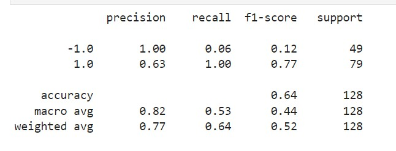
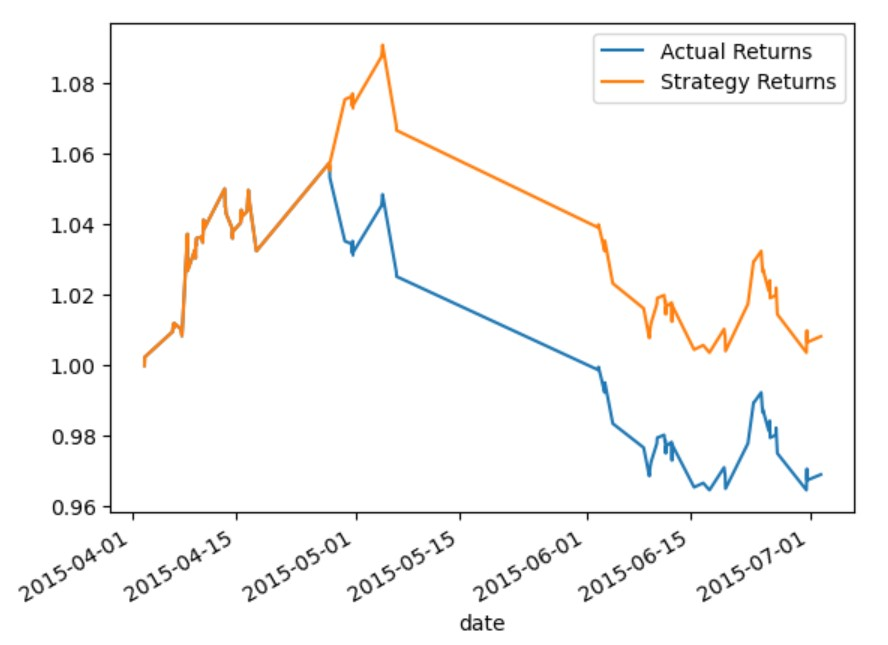

# HomeworkModule14 - Machine Learning Trading Bot
## Establish a Baseline Performance
Began by establishing a baseline performance for the trading algorithm using the SVC model with a training window of 3 months. The algorithm was tested and the performance was visualized using a cumulative return plot. The classification report for the baseline model is as follows:

## Tune the Baseline Trading Algorithm
- First increased the training window to 6 months and testing window to 3 hours . This change resulted in a more balanced recall between classes but also a decrease in precision and overall accuracy:

