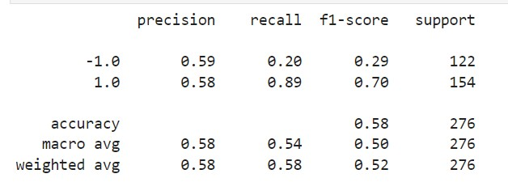
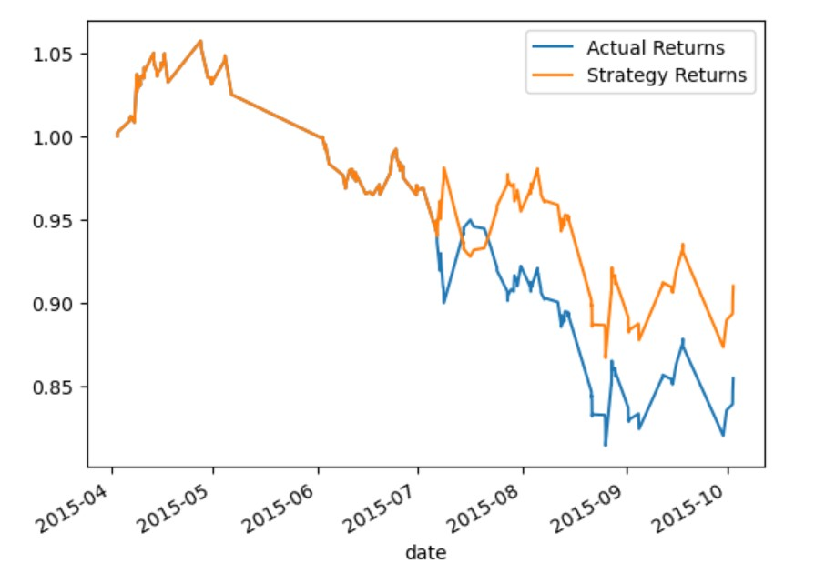
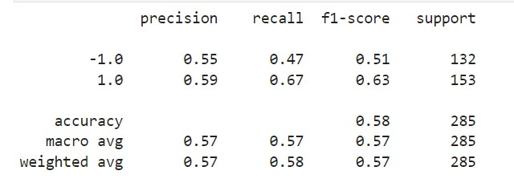
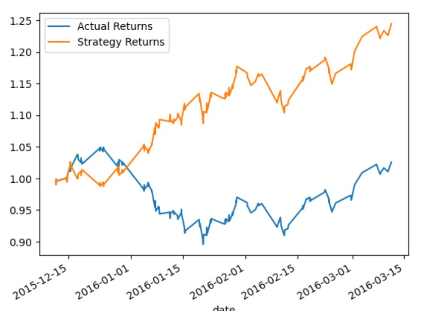
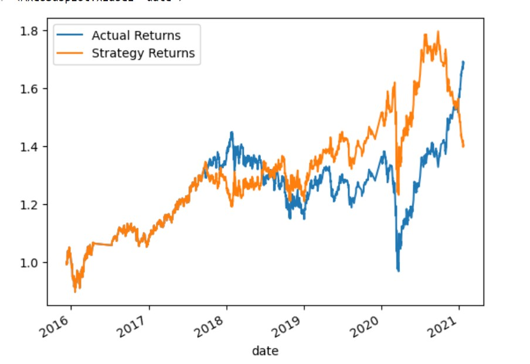

# HomeworkModule14 - Machine Learning Trading Bot
## Establish a Baseline Performance
Began by establishing a baseline performance for the trading algorithm using the SVC model with a training window of 3 months. The algorithm was tested and the performance was visualized using a cumulative return plot. The classification report for the baseline model is as follows:

## Tune the Baseline Trading Algorithm
- First increased the training window to 6 months and testing window to 3 hours . This change resulted in a more balanced recall between classes but also a decrease in precision and overall accuracy; The overall accuracy of the model decreased from 0.64 to 0.58. It suggests that with an increase in training window, the model's overall performance decreased. This might suggest that additional data might be introducing more complexity or noise, which is impacting the model's ability to make accurate predictions:

- We then adjusted the SMA windows to create longer rolling windows. This change resulted in an improved F1-score for class -1.0 and an overall balance between precision and recall, albeit with a trade-off between correctly identifying true positives and negatives.

## Evaluate a New Machine Learning Classifier - LogisticRegression
Evaluated the performance of the trading algorithm using LogisticRegression while keeping the original parameters. This analysis helped us determine whether changing the classifier could lead to improvements in the performance of the algorithm.

## Conclusion
The final evaluation report concludes that increasing the training window led to a more balanced recall but at the cost of precision and accuracy. Adjusting the SMA windows improved the F1-score for class -1.0 and provided an overall balance between precision and recall, but at a trade-off between correctly identifying true positives and negatives.
